  

# 🛡️ Awesome Bot Detection Platform & Mitigation Ecosystem

     

## 🌐 Top Bot Detection Platform Ecosystem

**Curated List of SaaS Platforms & Open-Source GitHub Repositories for Bot Detection, Web Scraping Prevention, AI Crawler Governance & Traffic Integrity**  
*📅 Last updated: March 2026*

Welcome to the definitive awesome list of **Bot Detection Platforms** 🛡️, **Bot Management Solutions** 🤖, **WAF Security Tools** 🧱, and **Open-Source Bot Mitigation Libraries** 💻. This repository tracks leading commercial SaaS vendors and active open-source projects designed to identify, classify, and block automated threat traffic—including web scrapers 🕵️‍♂️, credential stuffing bots 🔑, account takeover (ATO) scripts 💥, card testing bots 💳, and AI agents/LLM crawlers 🤖—protecting web applications 🌐, mobile apps 📱, and REST/GraphQL APIs 🔌 without degrading legitimate user experiences ✨.

---

## 📑 Table of Contents
- [📊 Market Overview: Size & Dynamics](#-market-overview-size--dynamics)
- [🏢 SaaS / Hosted Bot Protection Platforms](#-saas--hosted-bot-protection-platforms)
- [💻 Open-Source GitHub Bot Detection Repositories](#-open-source-github-bot-detection-repositories)
- [⚙️ Key Architectural Guidelines for Self-Hosting](#️-key-architectural-guidelines-for-self-hosting)
- [🤝 How to Contribute](#-how-to-contribute)
- [💖 Support & Sponsorship](#-support--sponsorship)
- [⚖️ Disclaimer](#️-disclaimer)

---

## 📊 Market Overview: Size & Dynamics

> [!NOTE]
> 📈 **Market Size**: The global Bot Detection and Mitigation market is estimated at **$1.50B – $1.80B in 2025/2026** and is projected to reach **$2.30B+ by late 2026**, driven by an explosion in AI crawler traffic, automated scrapers, and sophisticated API abuse.  
> 🧩 **Market Structure**: The sector is **moderately fragmented** but rapidly consolidating. It features an active mix of specialized pure-play bot management vendors (DataDome 🟢, HUMAN Security 🔴, Arkose Labs 🟣) and cloud infrastructure incumbents (Cloudflare ☁️, Akamai 🌐, Imperva 🛡️) integrating bot mitigation into all-in-one Web Application & API Protection (WAAP) platforms.

---

## 🏢 SaaS / Hosted Bot Protection Platforms

Below is a comparison of commercial bot detection platforms, sorted in **descending order by company size** (Revenue / Valuation / Market Cap):

| Product 🛠️ | Company Size 💰 (Revenue / Valuation) | Key Features & Capabilities ⚡ | Pricing 💵 | Free Tier Limit / Trial 🎁 |
| :--- | :--- | :--- | :--- | :--- |
| **[Cloudflare Bot Management](https://www.cloudflare.com/products/bot-management/)** ☁️ | **~$2.7B Revenue / ~$120B Market Cap** | Edge-based bot detection using ML, behavioral analysis, and JA3/JA4 TLS fingerprinting 🧬. Enterprise plans provide bot scores (1-99), detection IDs, and granular WAF custom rules. | $20/month (Pro plan with Super Bot Fight Mode); Enterprise plan required for full Bot Management. | Free Plan includes basic **Bot Fight Mode** 🥊 (unlimited requests, simple toggle challenge across entire zone, non-configurable). |
| **[Akamai Bot Manager](https://www.akamai.com/products/bot-manager)** 🌐 | **~$4.4B Revenue / ~$18B Market Cap** | Edge-integrated bot defense with real-time visibility, machine learning behavioral baselines, and minimal configuration overhead for web, mobile, and API. | Enterprise custom pricing (typically starting at **$2,000/month** based on bandwidth and request volume). | No permanent free tier; 30-day evaluation trial available for enterprise prospects upon inquiry. |
| **[Imperva Advanced Bot Protection](https://www.imperva.com/products/advanced-bot-protection-management/)** 🛡️ | **~$500M Revenue / $3.6B Valuation** *(Acquired by Thales)* | Multi-layered detection covering all OWASP 21 Automated Threats with dedicated AI Tools dashboard to govern LLM crawlers, AI agents, and fetch bots 🤖. | Starts at **$59/month** (Imperva Cloud WAF Pro plan); Advanced Bot Protection requires enterprise add-on. | 30-day Free Trial available ⏱️ (full Cloud Application Security & WAF package). |
| **[Radware Bot Manager](https://www.radware.com/products/bot-manager/)** 📡 | **~$318M Revenue / ~$1.3B Market Cap** | Comprehensive bot management solution specialized for web, mobile apps, and API endpoints defense with intentional human engagement intent analysis. | Starts at **$1,500/month** via AWS Marketplace pay-as-you-go / annual contract. | 30-day Free Trial available 🛍️ via AWS Marketplace / direct deployment. |
| **[HUMAN Security](https://www.humansecurity.com/)** 👤 | **~$100M ARR (Est.)** | Trust layer for digital customer experiences featuring AgenticTrust for verifying AI agents via cryptographic signatures 🔐. Correlated scoring across 6+ detection layers. | Custom enterprise quotes (contracts typically starting around **$2,500/month** based on request volume). | No free tier; custom interactive POC / guided evaluation available upon sales request. |
| **[PerimeterX (HUMAN)](https://www.humansecurity.com/)** 🚨 | **~$100M ARR (Est.)** *(Merged into HUMAN)* | Rebranded under HUMAN Security. Uses client/server behavioral signals, TLS fingerprints, and per-customer adaptive ML models updating in real time 🔄. | Integrated into HUMAN Security pricing (starts around **$2,500/month** for enterprise bot defense). | No standalone free tier; guided assessment demo available upon sales consultation. |
| **[DataDome](https://datadome.co/)** 🎯 | **~$50M ARR (Est.)** | AI-powered bot protection for web, mobile, and APIs with 9 response types (CAPTCHA, Device Check, Monetize). Invisible protection designed to preserve UX ✨. | Starts at **$3,830/month** (Essentials plan for web & mobile protection). | 30-day Free Trial available 🔍 (limited to Traffic Risk Assessment / Detection Mode without active blocking). |
| **[Arkose Labs](https://www.arkoselabs.com/)** 🏛️ | **~$48M ARR (Est.)** | Arkose Titan platform combining Bot Manager, Agent Trust Manager, Device ID, and interactive challenge security. Backed by a $1M warranty 💰 and 24/7 SOC 🛡️. | Custom enterprise subscription (typically starting at **$5,000/month** backed by SLA and $1M warranty). | No public free tier; tailored threat audit demo provided for enterprise applications. |
| **[Netacea](https://www.netacea.com/)** 🧠 | **~$29M ARR (Est.)** | Agentless AI bot detection analyzing hundreds of behavioral, device, and request signals. Integrated with Queue-it for waiting room bot defense deployments. | Custom subscription starting at **$2,000/month** based on processed web/API request volume. | No standard public free tier; 14-day proof-of-concept trial available after threat consultation. |
| **[Kasada](https://www.kasada.io/)** 🔒 | **~$25M ARR / ~$300M Valuation** | Advanced bot defense using VM-based JavaScript obfuscation ⚡ and client proof-of-work, protecting over $150B in eCommerce transactions against automated attacks. | Enterprise quote-based (typically starting around **$3,000/month** scaling with monthly active session volume). | No free tier; customized live traffic analysis / trial demo provided upon sales request. |

---

## 💻 Open-Source GitHub Bot Detection Repositories

Below is a curated list of active open-source projects for self-hosted bot detection, browser fingerprinting, crawler identification, and user-agent analysis, sorted in **descending order by GitHub Stars_Count**:

- **[FingerprintJS](https://github.com/fingerprintjs/fingerprintjs)** 🖐️   
  The leading open-source browser fingerprinting library in JavaScript 📜. Generates unique browser identifiers based on HTML5 canvas 🎨, WebGL, audio fingerprinting 🎧, and browser features to identify returning users and bot devices.

- **[CrowdSec](https://github.com/crowdsecurity/crowdsec)** 👥   
  Open-source crowdsourced security engine and IP reputation network 🌐. Includes WAF capabilities and bot detection challenge modules (combining proof-of-work challenges 🧩, fingerprinting, and behavioral analysis) compatible with NGINX, Traefik, Caddy, and Envoy.

- **[CrawlerDetect (PHP)](https://github.com/JayBizzle/Crawler-Detect)** 🐘   
  The industry-standard PHP class to detect bots, crawlers, and spiders via User-Agent inspection 🔍. Maintained with regular updates covering 1,000+ bot signatures.

- **[BotD (FingerprintJS)](https://github.com/fingerprintjs/BotD)** 🕵️   
  Dedicated browser-side bot detection JavaScript library from FingerprintJS 🧪. Uses 20+ detectors to examine browser engine identity, automation flags (`navigator.webdriver`), `eval.toString()` inconsistencies, and headlessness 🤖.

- **[browser-detect (Laravel)](https://github.com/hisorange/browser-detect)** 🔴   
  Popular Laravel package to detect user devices, browsers, operating systems, and automated bot requests 📱.

- **[isbot (JavaScript)](https://github.com/omusc/isbot)** 🟨   
  Ultra-lightweight JavaScript and Node.js module ⚡ to test whether a request originates from a search engine crawler or automated spider using regex patterns 🔤.

- **[scrapy-zyte-smartproxy](https://github.com/scrapy-plugins/scrapy-zyte-smartproxy)** 🐍   
  Scrapy middleware integration for managing proxy rotation 🔄 and counter-bot mitigation bypass during python-based web crawling.

- **[crawler_detect (Ruby)](https://github.com/loadkpi/crawler_detect)** 💎   
  Ruby gem port of CrawlerDetect to detect bots and spiders in Ruby on Rails applications 🛤️.

- **[crawlerdetect (Go)](https://github.com/x-way/crawlerdetect)** 🐹   
  Golang module to check incoming HTTP requests against bot/crawler patterns 🚀.

- **[isbot (Rust)](https://github.com/BryanMorgan/isbot)** 🦀   
  Fast Rust crate 🦀 to identify crawlers and bots from request HTTP headers.

- **[web-crawler-detection](https://github.com/zivdar001matin/web-crawler-detection)** 📊   
  Unsupervised machine learning repository 🧠 demonstrating clustering models for web log bot identification.

- **[Bot-Analytics-with-PHP](https://github.com/S4k1dl0/Bot-Analytics-with-PHP)** 📈   
  PHP and MySQL dashboard 🐬 for detecting, logging, and analyzing crawler traffic patterns.

---

### ⚙️ Key Architectural Guidelines for Self-Hosting

When building custom open-source bot detection solutions:
1. **Client-Side Identity** 🖐️: Use **FingerprintJS** or **BotD** to catch browser automation flags (`webdriver`), headlessness, and engine spoofing.
2. **Edge / Server Mitigation** 🧱: Deploy **CrowdSec** at the WAF/Reverse Proxy layer (NGINX/Traefik) to present proof-of-work challenges and enforce rate limits.
3. **User-Agent Filtering** 🔍: Integrate **CrawlerDetect** (PHP, Go, Ruby, or Rust) to filter simple spiders and scrapers at zero compute cost.

---

## 🤝 How to Contribute

Contributions are welcome! Please help keep this awesome list comprehensive and up to date:
1. Fork the repository 🍴.
2. Add or update entries in `README.md` keeping formatting consistent 📝.
3. Ensure descriptions are objective and concise 🎯.
4. Submit a Pull Request 🚀.

---

## 💖 Support & Sponsorship

Thank you for visiting and using this **Awesome Bot Detection Platform & Mitigation Ecosystem** list! 🌟

If you find this curated resource helpful for your research, security audit, or application development:
- ⭐ **Star** this repository to stay updated on new bot mitigation platforms and tools.
- 🍴 **Fork** it to build your own customized security stack or contribute back.
- 📢 **Share** it with your fellow security engineers, web developers, and platform teams!

If you'd like to support the ongoing maintenance and curation of this project:
- ☕ **Buy me a coffee / Sponsor the project**: 

---

## ⚖️ Disclaimer

- This list is **community-curated** for educational, technical, and informational purposes.
- Bot detection technologies must adhere to global data privacy laws (GDPR, CCPA) regarding user fingerprinting and network traffic logging 🔐.
- Self-hosted open-source security tools require ongoing maintenance and signature updates to mitigate false positives ⚖️.

---

  <b>Made with ❤️ for security engineers, platform teams, web developers, and fraud prevention specialists.</b>

  
Let's make bot detection more open, transparent, and effective.

---

## 📈 Star History

